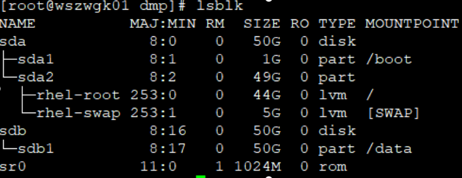

# 磁盘

## 挂载磁盘

在 virtualbox 虚拟机设置中添加 1 块硬盘。启动虚拟机后，执行：

- 查看磁盘

```
fdisk -l
lsblk
```



```bash
# 创建分区
fdisk /dev/sdb
# 依次输入：n, p,后面选项默认
# 最后输入：w 执行写入
```


```bash
# 格式化
mkfs.xfs /dev/sdb1
# 挂载分区到/data目录，
mkdir data
vim /etc/fstab
```


# 网络

## 探测端口的几种方式

1. 常用 telnet 118.10.6.128 88 方式测试远程主机端口是否打开。

2. nmap ip -p port 测试端口

nmap ip 显示全部打开的端口，根据显示 close/open 确定端口是否打开。

3. nc -v host port

端口未打开返回状态为非 0

# 监测

## top 命令详解

[https://www.cnblogs.com/dragonsuc/p/5512797.html](https://www.cnblogs.com/dragonsuc/p/5512797.html)
